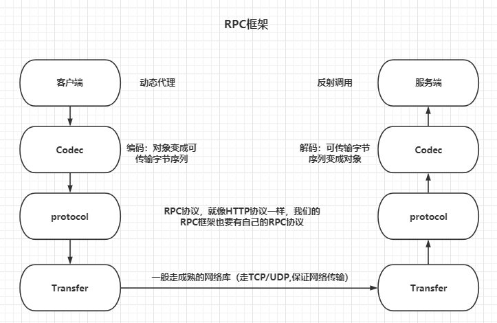
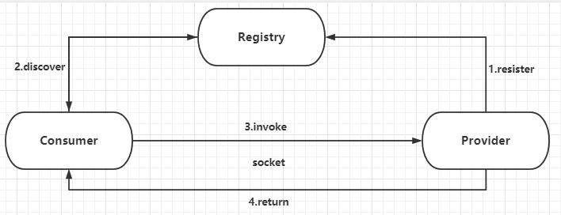

# MySimpleRPC

#### 介绍
 一个小型的自制RPC框架。底层使用SeverSocket进行网络通信，可配置Redis或Nacos为注册中心。

#### 软件架构
1. SpringBoot（实现以配置文件的方式配置框架的一些属性，以注解的方式注入和发现服务）
2. 使用SeverSocket（直接使用tcp在传输层为客户端和服务端实现通信）
3. 使用Redis与nacos作为注册中心供用户自定义配置使用
4. redis使用心跳机制维持注册

#### TODO
1. 在框架中是直接用的Java序列化，还需要考虑其他方式的序列化
2. 协议的编写：目前可以进行简单的通讯只有几个字段，还可以考虑其他的协议字段
3. 对于socket服务使用单独的线程进行阻塞监听，并且使用线程池对新的socket进行处理，可以考虑使用非阻塞型的模式，节约系统资源。

#### 快速上手
  **1.生成本地Maven依赖包：从以上的git仓库地址clone代码到本地，然后进入到项目pom目录中，执行maven安装命令：** 
```
mvn clean install
```
 **2.服务提供者-消费者同时引入该maven依赖**
```
        <dependency>
            <groupId>org.example</groupId>
            <artifactId>myrpcCommon</artifactId>
            <version>1.0-SNAPSHOT</version>
        </dependency>
```
 **3.服务提供者、消费者同时配置注册中心(请更换为自己的服务地址)，redis需要配置starter-data-redis的相关配置** 
```
huang:
  rpc:
    port: 1003
    loadBalancer: round #负载均衡类型
    register-type: nacos
    nacos-name-space: 532e59d2-de74-43f4-a440-360c9058681d
    nacos-ip: 127.0.0.1 #nacosIP地址
    nacos-port: 8848  #nacos端口
    redis-expire-time: #redis注册的过期时间，单位为ms
    redis-hear-beat: #心跳时间，单位为ms
#如果使用redis为注册中心
spring:
  redis:
    host: 127.0.0.1
    port: 6379
#    password: root
    timeout: 5s
      # 连接超时
    connect-timeout: 5s
```
 **4.服务提供者使用示例** 
```
@RpcService(“test”)
@Service("orderService")
public class OrderServiceImpl extends ServiceImpl<OrderDao, OrderEntity> implements OrderService {
    @Override
    public String getOrderById(String id) {
        ......
    }
}
```
 **5.服务消费者示例** 
```
@RestController
public class ConsumerController {
    @ClientRPC("test") //"test"为远程服务名
    private OrderService orderService; //本地接口服务
    @RequestMapping("/order/{id}")
    public String MyTest(@PathVariable("id")String id){
        return orderService.getOrderById("xxxxx"); //直接调用
    }
}
```

#### RPC原理
RPC(Remote procedure call)远程过程调用，简单理解是本地需要某个服务，而具体的服务由另外一个独立的服务端提供，我们可以通过网络等其他方式通知到服务端执行对应的服务，然后返回我们关心的信息。

##### 服务发现 
解决这个问题，可以采用第三方，即是专门来管理服务，一旦有服务请求来，就告诉对方所请求的服务的地址有哪些。服务注册及服务发现架构中主要有消费者，注册中心，提供者三方架构角色，消费者通过注册中心去订阅自己关心的服务，注册中心会将注册了的服务地址等相关信息返回给消费者，消费者再通过具体的协议将数据发送到socket中最后由网卡发送到网络上，最后得到服务提供者的响应数据。

#### 实现
##### 编写RPC协议
RpcRequest和RpcResponse都是RPC协议，RPC协议包括header和body两部分，header用Map表示，body用序列化后的byte[]流表示，这里的字节流的序列化的方式可以是Java的序列化方式，可以换成JSON序列化方式，在框架中直接使用Java的序列化方式。
然后body中被序列化的内容，RPCReuqest要调用一个方法，需要知道接口名、方法名、参数、参数类型，因此把这些东西放进RpcRequestBody中即可，后面把它序列化后放在RpcRequest的body字节流中；同理，RPCResponse 的body中，只需要一个被序列化后的Java Object即可。


##### 客户端实现（动态代理）
使用BeanPostProcessor对每个Bean的field进行查找，如果有RpcClient注解那么是使用jdk动态代理进行属性的替换

##### 服务端实现（反射调用）
使用BeanPostProcessor对每个Bean进行查找，如果有RpcService注解那么就注册到本地的缓存map中以便调用，并且注册当前地址到注册中心


